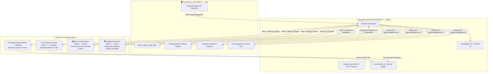
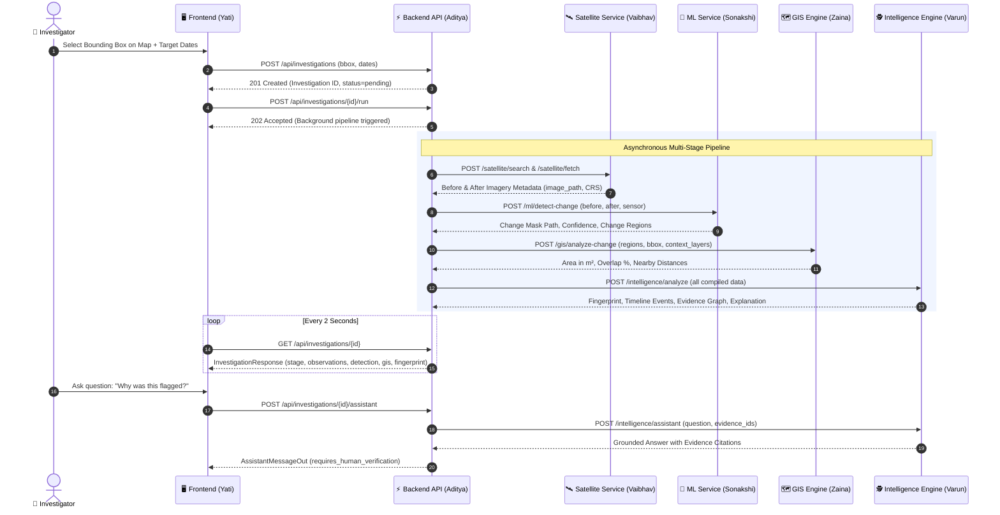

# 🛰️ UrbanChange AI

### **Explainable Geospatial Intelligence for Detecting, Understanding & Investigating Urban Change**

<p align="center">
  
  
  
  
  
  
  
  
  
</p>

---

## 📌 Executive Summary

**UrbanChange AI** is an AI-powered geospatial intelligence and decision-support platform designed to detect, classify, explain, and reconstruct physical changes across urban, peri-urban, and environmentally sensitive landscapes.

Instead of manually browsing satellite imagery catalogs, downloading gigabytes of rasters, and guessing why pixels changed, **UrbanChange AI** unifies the entire analytical journey into a single automated, explainable investigation:

$$\text{Satellite Imagery} \xrightarrow{\text{AI Detection}} \text{Pixel-Level Change} \xrightarrow{\text{GIS Context}} \text{Spatial Overlap} \xrightarrow{\text{Intelligence}} \text{Evidence Graph \ Explanation}$$

---

## 👥 Team Roles & Module Ownership

| Role | Team Member | Primary Domain | Codebase Location | Core Responsibilities |
|:---:|:---|:---|:---:|:---|
| **Role 1** | **Sonakshi** | **Machine Learning & Change Detection** | `/ml` | Siamese U-Net with Attention, pixel-level binary change masks, change region extraction, and classification |
| **Role 2** | **Vaibhav** | **Satellite Data Pipeline** | `/satellite` | Sentinel-2 STAC catalog search, cloud filtering, multi-spectral image fetch, radiance preprocessing, and alignment |
| **Role 3** | **Zaina** | **GIS & Spatial Context Engine** | `/gis` | Projected CRS transformations ($m^2$ calculations), sensitive-zone intersections (forests, water, roads), and spatial buffering |
| **Role 4** | **Aditya** | **Backend Orchestration & Integration Hub** | `/backend` | FastAPI orchestrator, PostGIS database, adapter layer (Mock/HTTP), asset serving, rate limiting, and 128 automated tests |
| **Role 5** | **Yati** | **Frontend Application & Dashboard** | `/frontend` | Interactive Maplibre/Leaflet AOI selector, split before/after viewer, change overlay rendering, and investigation timeline |
| **Role 6** | **Varun** | **AI Intelligence & Explainability** | `/intelligence` | Change Fingerprinting, temporal reconstruction, structured evidence graph generation, and Investigation Assistant Q&A |

---

## 🗺️ System Architecture



---

## 🔬 Core Capabilities

### 1. 🛰️ Automated Satellite Retrieval (Sentinel-2)
- Automatically queries the Copernicus / Planetary Computer STAC catalog for imagery matching an Area of Interest (AOI).
- Filters scenes based on max allowable cloud cover ($\le 30\%$).
- Aligns historical (`before`) and current (`after`) multi-spectral bands into standard formats for downstream inference.

### 2. 🔬 Deep Learning Change Detection & Classification
- **Architecture:** Siamese U-Net with Spatial & Channel Attention.
- Produces pixel-level change probability maps and binary masks.
- Extracts polygonized change region vectors (`GeoJSON`).
- Categorizes detected events into classes:
  - 🏗️ **Construction / Urban Expansion**
  - 🌲 **Vegetation Loss / Deforestation**
  - 🚜 **Excavation / Earthmoving**
  - 🛣️ **Infrastructure / Road Expansion**
  - 💧 **Water Body Alteration**

### 3. 🗺️ Spatial Context & Sensitive-Zone Overlap
- Re-projects geographic coordinates to local UTM projected CRS for accurate area calculations in **square meters ($m^2$)**.
- Intersects detected polygons with authoritative contextual layers:
  - Protected forests and national sanctuaries
  - Wetlands, coastal buffers, and floodplains
  - Proximity to nearest highways, utilities, and administrative boundaries

### 4. 🧬 Structured Change Fingerprinting
Every verified event is assigned a unique, immutable **Change Fingerprint**:
```text
┌────────────────────────────────────────────────────────┐
│ FINGERPRINT ID: UC-2026-A91F                           │
│ Classification: Construction & Heavy Excavation        │
│ Changed Area:   3,842 m² (38,420 pixels)               │
│ Confidence:     94.2%                                  │
│ Sensitive Zone: 64.0% overlap with [protected_forest]  │
│ First Detected: 2025-06-01                             │
│ Status:         requires_human_verification            │
└────────────────────────────────────────────────────────┘
```

### 5. ⏳ Temporal Reconstruction & Evidence Graph
- Reconstructs intermediate satellite acquisitions to determine the exact progression:
  $$\text{Undisturbed Forest} \longrightarrow \text{Initial Clearing} \longrightarrow \text{Foundation Work} \longrightarrow \text{Structure Erected}$$
- Every insight is backed by an **Evidence Graph** linking:
  $$\text{Satellite Scene ID} \longleftrightarrow \text{Change Mask} \longleftrightarrow \text{GIS Polygon} \longleftrightarrow \text{Classification Confidence}$$

### 6. 💬 Grounded AI Investigation Assistant
- Interactive Q&A grounded strictly in the compiled evidence records.
- Provides concise, citation-backed answers without hallucinating legal culpability.
- Strict constraint: Always includes `status: requires_human_verification`.

---

## 🔄 Investigation Workflow (Sequence Diagram)



---

## 🚀 Quick Start (Docker Compose — Recommended)

The platform includes a zero-dependency **Turnkey Docker Stack** that starts PostgreSQL with PostGIS and the backend in mock mode:

```bash
# 1. Clone the repository
git clone https://github.com/Aditya-dxt/UrbanChange-AI.git
cd UrbanChange-AI

# 2. Copy the environment configuration
cp .env.example .env

# 3. Launch the full platform
docker compose up -d --build

# 4. View logs (automatic Alembic migrations run on boot)
docker compose logs -f backend
```

Once running, access:
- **Interactive OpenAPI Docs (Swagger):** [http://localhost:8000/docs](http://localhost:8000/docs)
- **ReDoc Documentation:** [http://localhost:8000/redoc](http://localhost:8000/redoc)
- **Liveness Probe:** [http://localhost:8000/health](http://localhost:8000/health)
- **Readiness Probe:** [http://localhost:8000/health/ready](http://localhost:8000/health/ready)

To shut down:
```bash
docker compose down
```

---

## 💻 Local Development Setup (Manual)

### Prerequisites
- Python 3.10 or 3.11
- PostgreSQL 15+ with PostGIS extension (or Docker for DB only)

```bash
cd backend

# Create & activate virtual environment
python -m venv .venv
# Windows:
.venv\Scripts\activate
# macOS/Linux:
source .venv/bin/activate

# Install runtime & development dependencies
pip install -r requirements.txt -r requirements-dev.txt

# Configure environment
cp ../.env.example .env

# Apply PostGIS database migrations
alembic upgrade head

# Run local development server
uvicorn app.main:app --reload --port 8000
```

---

## 🧪 Automated Testing & Quality Assurance

The backend repository contains **128 comprehensive automated tests** across unit, contract, and integration layers:

```bash
# From the backend/ directory:
pytest
```

```text
============================= test session starts ==============================
collected 128 items

tests/unit/test_mappers.py ................................. [ 25%]
tests/unit/test_asset_service.py .................          [ 39%]
tests/contract/test_contracts.py .............              [ 49%]
tests/integration/test_endpoints.py ....................... [100%]

======================== 128 passed in 52.68s ==================================
```

### Module Integration Checker
To check if each teammate's live HTTP service is healthy and honors the shared contract before integration day:

```bash
python scripts/check_modules.py
```

```text
UrbanChange AI — Module Integration Checker
CONTRACT_VERSION: 0.1.0

MODULE                    MODE        RESULT    DETAIL
------------------------------------------------------------------------------------------
satellite                 mock        MOCK      
ml                        mock        MOCK      
gis                       mock        MOCK      
intelligence              mock        MOCK      
intelligence/assistant    mock        MOCK      

All checked modules PASS. Ready for integration.
```

---

## 📂 Repository Layout

```text
UrbanChange-AI/
├── .env.example                 # Root environment template for Docker & teammates
├── docker-compose.yml           # Multi-container orchestration (PostGIS + Backend)
├── README.md                    # Root project documentation (this file)
│
├── backend/                     # Role 4 — Backend Orchestration & DB (Aditya)
│   ├── app/
│   │   ├── adapters/            # Mock, HTTP, and Python-Module adapters
│   │   │   ├── http/            # Resilient HTTP clients (retries + backoff)
│   │   │   ├── mappers/         # Tolerant translation & alias resolution
│   │   │   └── mock/            # High-fidelity fixture-based mock adapters
│   │   ├── api/
│   │   │   └── routers/         # /investigations, /assets, /health endpoints
│   │   ├── db/                  # PostGIS models (11 ORM entities) & async session
│   │   ├── jobs/                # Asynchronous JobRunner interface
│   │   ├── schemas/             # Pydantic v2 internal, external, and API models
│   │   └── services/            # PipelineOrchestrator, AssetService, InvestigationService
│   ├── alembic/                 # PostGIS spatial database migrations
│   ├── scripts/                 # check_modules.py & schema export utilities
│   ├── tests/                   # 128 tests (unit/, contract/, integration/)
│   ├── Dockerfile               # Production container definition
│   └── README.md                # 700+ line teammate integration guide
│
├── docs/                        # Specifications & Schema References
│   ├── API_CONTRACTS.md         # Exact input/output contracts for Persons 1, 2, 3, 6
│   └── DATABASE_SCHEMA.md       # Full PostGIS ER diagram & column documentation
│
└── shared/                      # Shared Specifications & Assets
    └── schemas/                 # 11 generated JSON Schema definitions
        ├── api/                 # Response schemas for Person 5 (Frontend)
        └── external/            # Expected output schemas for Persons 1, 2, 3, 6
```

---

## 🔌 Integrating Teammate Modules (Switching from Mock to Real)

No backend code changes are required when switching any domain module from mock to real. Simply update `.env`:

```env
# Change from 'mock' to 'http' and supply the teammate's host & port:
SATELLITE_ADAPTER=http
SATELLITE_BASE_URL=http://192.168.1.101:8001

ML_ADAPTER=http
ML_BASE_URL=http://192.168.1.102:8002

GIS_ADAPTER=http
GIS_BASE_URL=http://192.168.1.103:8003

INTELLIGENCE_ADAPTER=http
INTELLIGENCE_BASE_URL=http://192.168.1.104:8004
```

Then run `python backend/scripts/check_modules.py` to verify the connection and payload conformity.

---

## ⚖️ Responsible AI & Ethical Use

> [!IMPORTANT]
> **UrbanChange AI is a Decision-Support System, Not an Autonomous Legal Authority.**
>
> 1. **No Autonomous Legal Verdicts:** The system observes spatial change, quantifies pixel differences, and checks overlaps with publicly available GIS layers. It **never** unilaterally declares an activity "illegal", "unauthorized", or "criminal".
> 2. **Mandatory Human Verification:** Every output carries the status `requires_human_verification`.
> 3. **Uncertainty Transparency:** Sensor limitations, cloud shadows, seasonal foliage variances, and model confidence scores are exposed transparently in every API response.

---

## 📜 License

This project is licensed under the [MIT License](LICENSE).
