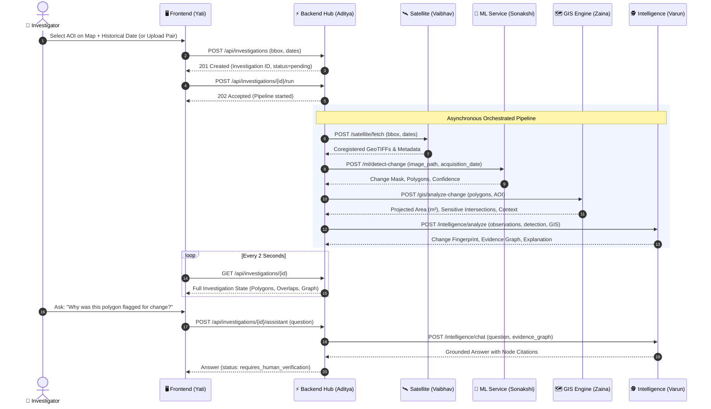
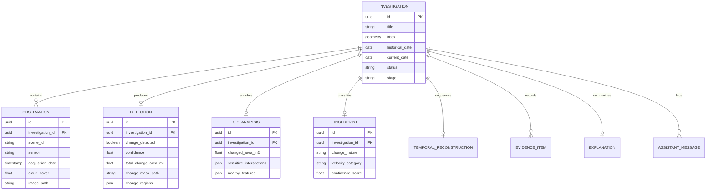

# 🛰️ UrbanChange AI

### **Explainable Geospatial Intelligence for Detecting, Understanding & Investigating Urban Change**

<p align="center">
  
  
  
  
  
  
  
  
  
</p>

---

## 📌 Executive Summary

**UrbanChange AI** is an AI-powered geospatial intelligence and decision-support platform designed to detect, classify, explain, and reconstruct physical changes across urban, peri-urban, and environmentally sensitive landscapes.

Instead of manually browsing satellite imagery catalogs, downloading gigabytes of rasters, and guessing why pixels changed, **UrbanChange AI** unifies the entire analytical journey into a single automated, explainable investigation:

$$\text{Satellite Imagery} \xrightarrow{\text{AI Detection}} \text{Pixel-Level Change} \xrightarrow{\text{GIS Context}} \text{Spatial Overlap} \xrightarrow{\text{Intelligence}} \text{Evidence Graph \& Explanation}$$

> [!NOTE]
> **Mock Data Disclosure:**
> **Yes, mock data is used.** In accordance with Phase 8 specifications, the Machine Learning service operates in high-fidelity mock adapter mode (`ML_ADAPTER=mock`), and GIS provides clearly-labeled sample sensitive layers for offline evaluation and expo presentation. The entire system is architected around strict JSON schema contracts (`shared/schemas`), allowing the real ML service or additional GIS layers to be hot-swapped into live production with zero code changes.

---

## 👥 Team Roles & Module Ownership

| Role | Team Member | Primary Domain | Codebase Location | Core Responsibilities |
|:---:|:---|:---|:---:|:---|
| **Role 1** | **Sonakshi** | **Machine Learning & Change Detection** | `/ml` | Siamese U-Net with Attention, pixel-level binary change masks, change region extraction, and classification |
| **Role 2** | **Vaibhav** | **Satellite Data Pipeline** | `/satellite` | Sentinel-2 STAC catalog search, cloud filtering, windowed COG streaming, radiance preprocessing, and grid alignment |
| **Role 3** | **Zaina** | **GIS & Spatial Context Engine** | `/gis` | Projected UTM CRS transformations ($m^2$ calculations), sensitive-zone intersections (forests, water, roads), and spatial buffering |
| **Role 4** | **Aditya** | **Backend Orchestration & Integration Hub** | `/backend` | FastAPI orchestrator, PostGIS database, adapter layer (Mock/HTTP), asset serving, upload pipeline, rate limiting, and 144 passing tests |
| **Role 5** | **Yati** | **Frontend Application & Dashboard** | `/frontend` | Interactive Leaflet AOI selector, split before/after viewer, change overlay rendering, evidence graph view, and investigation timeline |
| **Role 6** | **Varun** | **AI Intelligence & Explainability** | `/intelligence` | Change Fingerprinting, temporal reconstruction, structured directed evidence graph generation, and MiniLM-grounded Assistant Q&A |

---

## 🗺️ System Architecture

```mermaid
flowchart TB
    subgraph UI ["🖥️ Presentation Layer (Role 5 — Yati)"]
        A1["Interactive Map (AOI Rectangle Selection)"]
        A2["Before / After Image Swipe Slider"]
        A3["Change Mask & Overlap Overlay"]
        A4["Evidence Graph Inspector & Timeline"]
        A5["AI Investigation Assistant Chat"]
    end

    subgraph HUB ["⚡ Integration Hub & Backend (Role 4 — Aditya)"]
        B1["FastAPI Pipeline Orchestrator"]
        B2["PostgreSQL 16 + PostGIS 3.4 (11 ORM Entities)"]
        B3["Adapter Layer (Mock / HTTP / Python)"]
        B4["Asset Service & Traversal Shield"]
        B5["Upload Pipeline & Rate Limiter"]
    end

    subgraph ENGINES ["🧠 Domain Processing Engines"]
        C1["🛰️ Satellite Service (Role 2 — Vaibhav)<br/>Sentinel-2 Windowed COG Search & Fetch"]
        C2["🔬 ML Detection Service (Role 1 — Sonakshi)<br/>Siamese Attention U-Net (Mock Adapter)"]
        C3["🗺️ GIS Context Service (Role 3 — Zaina)<br/>Projected UTM Area (m²) & Sensitive Overlap"]
        C4["🕵️ Intelligence Engine (Role 6 — Varun)<br/>Fingerprint, Directed Graph & MiniLM Assistant"]
    end

    A1 -->|POST /api/investigations| B1
    A1 -->|POST /api/investigations/upload| B5
    B1 --> B2
    B1 -->|Stage 1: Retrieve Imagery| C1
    C1 -->|Before & After TIFs| B4
    B1 -->|Stage 2: Detect Changes| C2
    C2 -->|Change Mask & Polygons| B4
    B1 -->|Stage 3: Spatial Context| C3
    C3 -->|Metric Area m² & Overlaps| B1
    B1 -->|Stage 4: Synthesize Intelligence| C4
    C4 -->|Fingerprint, Evidence Graph & Explanation| B1
    B1 -->|Polling GET /api/investigations/:id| A2 & A3 & A4 & A5
```



---

## 🔄 Investigation Workflow (Sequence Diagram)



---

## 🗄️ Database Entity-Relationship Diagram



---

## 🚀 Quick Start (Docker Compose)

The repository provides two Docker Compose deployment profiles:

### 1. Demo Profile (Recommended for Evaluation & Expo)
Brings up PostgreSQL with PostGIS, the Backend, and the Frontend UI. All backend adapters run in self-contained `mock` mode with zero external dependencies:

```bash
# 1. Clone repository
git clone https://github.com/Aditya-dxt/UrbanChange-AI.git
cd UrbanChange-AI

# 2. Configure environment
cp .env.example .env

# 3. Launch stack
docker compose up --build
```

### 2. Live Profile
Launches the complete microservice network including the Satellite Service, GIS Engine, and Intelligence Engine:

```bash
# Set in .env:
# SATELLITE_ADAPTER=http
# GIS_ADAPTER=http
# INTELLIGENCE_ADAPTER=http
# ML_ADAPTER=mock

docker compose --profile live up --build
```

Once running, access:
- **Frontend Dashboard:** [http://localhost](http://localhost) (or [http://localhost:5173](http://localhost:5173))
- **Backend API Docs (Swagger):** [http://localhost:8000/docs](http://localhost:8000/docs)
- **Readiness Probe:** [http://localhost:8000/health/ready](http://localhost:8000/health/ready)

---

## 💻 Local Development Setup

### Prerequisites
- Python 3.10+
- Node.js 18+
- PostgreSQL 16 with PostGIS 3.4 (or run postgres via `docker compose up postgres -d`)

### Backend Setup
```bash
cd backend
python -m venv .venv
# Windows:
.venv\Scripts\activate
# macOS/Linux:
source .venv/bin/activate

pip install -r requirements.txt -r requirements-dev.txt
alembic upgrade head
uvicorn app.main:app --reload --port 8000
```

### Frontend Setup
```bash
cd frontend/urbanchange-ui
npm install
npm run dev
```

---

## 🧪 Automated Testing & E2E Verification

The system includes **144 passing automated backend tests** and dedicated end-to-end integration scripts:

```bash
# Run backend test suite (144 tests)
pytest backend/tests

# Run module integration checker against contract fixtures
python backend/scripts/check_modules.py

# Run End-to-End pipeline verification test (create -> run -> poll -> assist)
python scripts/test_e2e_demo.py --url http://localhost:8000
```

---

## 🔌 Instructions for ML Owner (Person 1 — Sonakshi)

The backend is currently connected to `ML_ADAPTER=mock`. When your Siamese Attention U-Net service is running, follow these steps to plug it into the live pipeline:

1. **Service Endpoint:** Expose `POST /ml/detect-change` (or `POST /ml/detect`) on port `8002`.
2. **Contract Payload:**
   - **Request:**
     ```json
     {
       "image_path": "/data/storage/satellite/before.tif",
       "acquisition_date": "2023-01-15T00:00:00Z",
       "baseline_image_path": "/data/storage/satellite/before.tif",
       "target_image_path": "/data/storage/satellite/after.tif"
     }
     ```
   - **Response:**
     ```json
     {
       "change_detected": true,
       "confidence": 0.94,
       "changed_area_pixels": 4520,
       "change_mask_path": "/data/storage/ml/mask.tif",
       "change_regions": [
         {
           "label": "construction",
           "confidence": 0.94,
           "geometry": {
             "type": "Polygon",
             "coordinates": [[[77.10, 28.60], [77.12, 28.60], [77.12, 28.62], [77.10, 28.62], [77.10, 28.60]]]
           }
         }
       ],
       "classification": "construction",
       "model_version": "siamese-unet-attn-v1.0"
     }
     ```
   - *Note on Geometries:* Coordinates must be GeoJSON Polygon in WGS84 (EPSG:4326), `[longitude, latitude]`.
3. **Switch Adapter:**
   In `.env`, set:
   ```env
   ML_ADAPTER=http
   ML_BASE_URL=http://localhost:8002
   ```

---

## 🎬 3-Minute Expo Demo Walkthrough

1. **Area Selection:** Open the UI at [http://localhost:5173](http://localhost:5173), draw a bounding box over the target region on the map, and select a historical baseline date.
2. **Detection Execution:** Click the **Detect** button. The progress bar visualizes the orchestrated stages: *Satellite Retrieval $\rightarrow$ ML Detection $\rightarrow$ GIS Analysis $\rightarrow$ Intelligence Synthesis*.
3. **Interactive Investigation:**
   - Use the **Before/After Split Slider** to inspect raw Sentinel-2 surface reflectance imagery.
   - Toggle the **Change Polygons Overlay** to view segmented boundaries and true metric area ($m^2$).
   - Examine the **Sensitive Zone Intersections** showing overlap percentages with eco-sensitive buffers.
4. **Evidence & Explainability:**
   - Inspect the **Change Fingerprint** displaying confidence, nature, and progression velocity.
   - Explore the **Evidence Graph** linking satellite acquisitions to detection and regulatory nodes.
5. **Ask the Assistant:**
   - Type: *"Why was this area flagged as high risk?"*
   - Observe the grounded response citing specific evidence IDs (`node_det_001`, `node_gis_001`) with the statutory verification banner (`status: requires_human_verification`).

---

## ⚖️ Responsible AI & Ethical Use

> [!IMPORTANT]
> **UrbanChange AI is an Explainable Decision-Support System, Not an Autonomous Legal Authority.**
>
> 1. **No Autonomous Legal Verdicts:** The system observes spatial change, quantifies pixel differences, and checks overlaps with publicly available GIS layers. It **never** unilaterally declares an activity "illegal", "unauthorized", or "criminal".
> 2. **Mandatory Human Verification:** Every output carries the status `requires_human_verification`.
> 3. **Uncertainty Transparency:** Sensor limitations, cloud shadows, seasonal foliage variances, and model confidence scores are exposed transparently in every API response.

---

## 📜 License

This project is licensed under the [MIT License](LICENSE).
