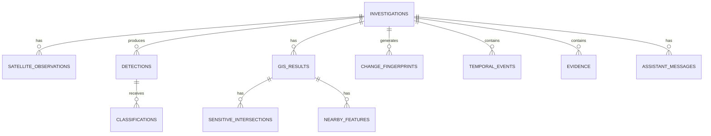

# UrbanChange AI — Database Schema

> Maintained by Person 4 (Backend).
> Run `alembic upgrade head` to apply all migrations.
> Run `alembic revision --autogenerate -m "description"` after changing `app/db/models.py`.

---

## ER Diagram



---

## Table Reference

### `investigations`

Root record. Created by `POST /api/investigations`.

| Column | Type | Nullable | Notes |
|---|---|---|---|
| `id` | UUID PK | NO | Server-generated UUID4 |
| `aoi` | geometry(Polygon,4326) | YES | PostGIS polygon of the AOI |
| `bbox` | float[] | YES | `[west, south, east, north]` — cached for fast reads |
| `historical_date` | date | NO | User-supplied historical date |
| `current_date` | date | YES | User-supplied or today |
| `status` | varchar(32) | NO | `pending\|running\|completed\|partial\|failed` |
| `stage` | varchar(64) | YES | Current/last pipeline stage name |
| `failed_stage` | varchar(64) | YES | Stage name that failed (when `status=partial\|failed`) |
| `satellite_failure_reason` | text | YES | Human-readable reason when satellite found no imagery |
| `created_at` | timestamptz | NO | |
| `updated_at` | timestamptz | NO | Updated by orchestrator at each stage |

**Indexes:** `ix_investigations_status`

---

### `satellite_observations`

One record per satellite scene (before, after, or intermediate).

| Column | Type | Nullable | Notes |
|---|---|---|---|
| `id` | UUID PK | NO | |
| `investigation_id` | UUID FK | NO | → `investigations.id` CASCADE DELETE |
| `role` | varchar(16) | NO | `before\|after\|intermediate` |
| `scene_id` | varchar(256) | NO | Satellite catalogue scene ID |
| `sensor` | varchar(64) | NO | e.g. `Sentinel-2` |
| `acquisition_date` | date | NO | |
| `cloud_cover` | float | YES | 0–100 % |
| `crs` | varchar(32) | YES | e.g. `EPSG:32643` |
| `resolution` | float | YES | Metres per pixel |
| `image_path` | text | YES | Relative to `STORAGE_ROOT` |
| `preview_path` | text | YES | Relative to `STORAGE_ROOT`; null if no browser preview |
| `bounds` | float[] | YES | `[west, south, east, north]` for map overlay |
| `raw_payload` | jsonb | YES | Exact unmodified module response |
| `created_at` | timestamptz | NO | |

**Indexes:** `ix_satellite_observations_investigation_id`

---

### `detections`

ML change-detection result.

| Column | Type | Nullable | Notes |
|---|---|---|---|
| `id` | UUID PK | NO | |
| `investigation_id` | UUID FK | NO | → `investigations.id` CASCADE DELETE |
| `change_detected` | boolean | NO | |
| `confidence` | float | NO | 0–1 |
| `changed_area_pixels` | integer | NO | |
| `change_mask_path` | text | YES | Relative to `STORAGE_ROOT` (TIF) |
| `mask_preview_path` | text | YES | Relative to `STORAGE_ROOT` (PNG preview) |
| `mask_bounds` | jsonb | YES | `[west, south, east, north]` |
| `change_regions` | jsonb | YES | GeoJSON Feature array (WGS84 Polygons) |
| `model_version` | varchar(128) | NO | e.g. `siamese-unet-attention-v1` |
| `preprocessing_version` | varchar(64) | YES | |
| `threshold` | float | YES | Decision threshold used |
| `raw_payload` | jsonb | YES | |
| `created_at` | timestamptz | NO | |

**Indexes:** `ix_detections_investigation_id`

---

### `classifications`

Change classification label linked to a detection.

| Column | Type | Nullable | Notes |
|---|---|---|---|
| `id` | UUID PK | NO | |
| `detection_id` | UUID FK | NO | → `detections.id` CASCADE DELETE |
| `investigation_id` | UUID FK | NO | → `investigations.id` CASCADE DELETE |
| `label` | varchar(64) | NO | e.g. `construction`, `vegetation_loss` |
| `confidence` | float | NO | 0–1 |
| `raw_payload` | jsonb | YES | |

**Indexes:** `ix_classifications_detection_id`, `ix_classifications_investigation_id`

---

### `gis_results`

GIS spatial-analysis result.

| Column | Type | Nullable | Notes |
|---|---|---|---|
| `id` | UUID PK | NO | |
| `investigation_id` | UUID FK | NO | → `investigations.id` CASCADE DELETE |
| `changed_area_m2` | float | NO | Passed through from GIS module; no backend math |
| `overlap_percentages` | jsonb | YES | `{"layer_name": overlap_pct}` |
| `distances` | jsonb | YES | `{"feature_type": distance_m}` |
| `geojson` | jsonb | YES | GeoJSON FeatureCollection |
| `layer_versions` | jsonb | YES | `{"layer_name": "version_string"}` |
| `raw_payload` | jsonb | YES | |
| `created_at` | timestamptz | NO | |

**Indexes:** `ix_gis_results_investigation_id`

---

### `sensitive_intersections`

One geographic layer that overlaps the change region.

| Column | Type | Nullable | Notes |
|---|---|---|---|
| `id` | UUID PK | NO | |
| `investigation_id` | UUID FK | NO | → `investigations.id` CASCADE DELETE |
| `gis_result_id` | UUID FK | NO | → `gis_results.id` CASCADE DELETE |
| `layer_name` | varchar(128) | NO | e.g. `protected_forest` |
| `layer_id` | varchar(128) | YES | |
| `overlap_pct` | float | NO | 0–100 |
| `geometry` | geometry(GEOMETRY,4326) | YES | PostGIS intersection geometry |
| `raw_payload` | jsonb | YES | |

**Indexes:** `ix_sensitive_intersections_investigation_id`, `ix_sensitive_intersections_gis_result_id`

---

### `nearby_features`

Notable geographic features near the change area.

| Column | Type | Nullable | Notes |
|---|---|---|---|
| `id` | UUID PK | NO | |
| `investigation_id` | UUID FK | NO | → `investigations.id` CASCADE DELETE |
| `gis_result_id` | UUID FK | NO | → `gis_results.id` CASCADE DELETE |
| `feature_type` | varchar(64) | NO | e.g. `road`, `water_body` |
| `name` | varchar(256) | YES | |
| `distance_m` | float | NO | Distance in metres |
| `raw_payload` | jsonb | YES | |

**Indexes:** `ix_nearby_features_investigation_id`

---

### `change_fingerprints`

Structured change fingerprint from the Intelligence module.

| Column | Type | Nullable | Notes |
|---|---|---|---|
| `id` | UUID PK | NO | |
| `investigation_id` | UUID FK | NO | → `investigations.id` CASCADE DELETE |
| `fingerprint_id` | varchar(64) UNIQUE | NO | e.g. `UC-2026-A91F` |
| `change_type` | varchar(64) | NO | e.g. `construction` |
| `confidence` | float | YES | |
| `changed_area_m2` | float | YES | |
| `temporal_behavior` | varchar(64) | YES | e.g. `progressive` |
| `sensitive_overlap` | jsonb | YES | `{"percentage": float, "layers": [str]}` |
| `first_observed` | date | YES | |
| `model_version` | varchar(128) | YES | |
| `raw_payload` | jsonb | YES | |
| `created_at` | timestamptz | NO | |

**Indexes:** `ix_change_fingerprints_investigation_id`, `ix_change_fingerprints_fingerprint_id` (unique)

---

### `temporal_events`

One step in the temporal reconstruction timeline.

| Column | Type | Nullable | Notes |
|---|---|---|---|
| `id` | UUID PK | NO | |
| `investigation_id` | UUID FK | NO | → `investigations.id` CASCADE DELETE |
| `observation_date` | date | NO | |
| `event_type` | varchar(64) | NO | e.g. `ground_disturbance`, `structure_complete` |
| `description` | text | YES | |
| `confidence` | float | YES | |
| `area_delta_m2` | float | YES | Area change at this step |
| `raw_payload` | jsonb | YES | |

**Indexes:** `ix_temporal_events_investigation_id`

---

### `evidence`

One traceable item in the evidence graph.

| Column | Type | Nullable | Notes |
|---|---|---|---|
| `id` | UUID PK | NO | |
| `investigation_id` | UUID FK | NO | → `investigations.id` CASCADE DELETE |
| `evidence_type` | varchar(64) | NO | e.g. `satellite_observation`, `detection` |
| `source_reference` | varchar(256) | NO | e.g. `scene_id:S2A_…` |
| `extra_metadata` | jsonb | NO | DB column name is `metadata`; Python attr renamed because SQLAlchemy reserves `metadata` on `DeclarativeBase`. Default `{}` |
| `raw_payload` | jsonb | YES | |

**Indexes:** `ix_evidence_investigation_id`

---

### `assistant_messages`

Chat messages for the AI Investigation Assistant.

| Column | Type | Nullable | Notes |
|---|---|---|---|
| `id` | UUID PK | NO | |
| `investigation_id` | UUID FK | NO | → `investigations.id` CASCADE DELETE |
| `role` | varchar(16) | NO | `user\|assistant` |
| `content` | text | NO | |
| `evidence_ids` | jsonb | YES | JSON array of evidence ID strings |
| `uncertainty_notes` | text | YES | |
| `created_at` | timestamptz | NO | |

**Indexes:** `ix_assistant_messages_investigation_id`

---

## Design decisions

| Decision | Reason |
|---|---|
| UUID primary keys everywhere | Avoids sequential ID enumeration; safe to generate client-side for tracing |
| `raw_payload JSONB` on every module-result table | Full traceability; debug without re-running the module |
| `aoi` as PostGIS Polygon + `bbox` float array | PostGIS for spatial queries; bbox for fast JSON reads without ST_Envelope |
| JSONB for `change_regions`, `geojson`, `overlap_percentages` | Schema-flexible; GIS module controls the structure |
| `evidence_ids` in `assistant_messages` as JSONB array | Avoids a separate join table; evidence IDs are string references |
| All geometry columns SRID 4326 (WGS-84) | Matches GeoJSON convention (`[longitude, latitude]`) |
| `ondelete="CASCADE"` on all FK columns | Deleting an investigation cleanly removes all related records |

---

## Migrations

```bash
# Apply all pending migrations
alembic upgrade head

# Rollback last migration
alembic downgrade -1

# Show current DB revision
alembic current

# Show full migration history
alembic history

# Generate new migration after editing models.py
alembic revision --autogenerate -m "add my new field"
```

> **PostGIS requirement:** The first migration creates `postgis` extension.
> Your Postgres user needs `SUPERUSER` or `CREATE` privilege.
> With Docker Compose the `db` service runs as `postgres` (superuser) by default.
